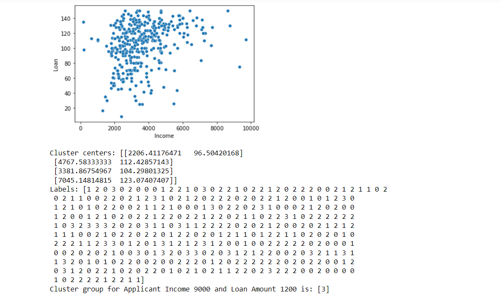

# Implementation of K-Means Clustering Algorithm
## Aim
To write a python program to implement K-Means Clustering Algorithm.
## Equipment’s required:
1.	Hardware – PCs
2.	Anaconda – Python 3.7 Installation

## Algorithm:

### Step1
Import pandas,KMeans,matplotlib.pyplot,seaborn.

### Step2
Read the csv file and print first two rows using head() and specified columns.

### Step3
Use sns to plot the graph.

### Step4
By using KMeans find clusters_centers and labels_.

### Step5
Using predict() print the output.

## Program:
```
import pandas as pd
from sklearn.cluster import KMeans
import matplotlib.pyplot as plt
import seaborn as sns
x1=pd.read_csv("clustering.csv")
print(x1.head(2))
x2=x1.loc[:,['ApplicantIncome','LoanAmount']]
print(x2.head(2))


x=x2.values
#print(x)
sns.scatterplot(x[:,0],x[:,1])
plt.xlabel("Income")
plt.ylabel("Loan")
plt.show()

kmeans=KMeans(n_clusters=4)
kmeans.fit(x)
print("Cluster centers:",kmeans.cluster_centers_)
print("Labels:",kmeans.labels_)
predict_class=kmeans.predict([[9000,1200]])
print("Cluster group for Applicant Income 9000 and Loan Amount 1200 is:",predict_class)

```
## Output:



## Result
Thus the K-means clustering algorithm is implemented and predicted the cluster class using python program.